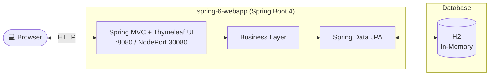

# Spring 6 Web Application

## Overview

This project is a Spring Boot 4 web application. It serves as a template or starting point for building web applications using the Spring Framework

## Architecture Overview



## Prerequisites

- Java 25
- Maven Wrapper (included)

## Available Endpoints via browser

The application provides two main endpoints:
- `http://localhost:8080/authors` - Displays information about authors
- `http://localhost:8080/books` - Displays information about books

- `http://localhost:30080/authors` - Displays information about authors
- `http://localhost:30080/books` - Displays information about books
- `http://localhost:8080/h2-console` - h2 console

## Deployment with Helm

Be aware that we are using a different namespace here (not default).

To run maven filtering for destination target/helm

```bash
mvn clean install -DskipTests 
```

Go to the directory where the tgz file has been created after 'mvn install'

```powershell
cd target/helm/repo
```

unpack

```powershell
$file = Get-ChildItem -Filter spring-6-webapp-chart-*.tgz | Select-Object -First 1
tar -xvf $file.Name
```

install

```powershell
$APPLICATION_NAME = Get-ChildItem -Directory | Where-Object { $_.LastWriteTime -ge $file.LastWriteTime } | Select-Object -ExpandProperty Name
helm upgrade --install $APPLICATION_NAME ./$APPLICATION_NAME --namespace spring-6-webapp --create-namespace --wait --timeout 8m --debug --render-subchart-notes
```

show logs

```powershell
kubectl get pods -l app.kubernetes.io/name=$APPLICATION_NAME -n spring-6-webapp
```

replace $POD with pods from the command above

```powershell
kubectl logs $POD -n spring-6-webapp --all-containers
```

test

```powershell
helm test $APPLICATION_NAME --namespace spring-6-webapp --logs
```

uninstall

```powershell
helm uninstall $APPLICATION_NAME --namespace spring-6-webapp
```

delete all

```powershell
kubectl delete all --all -n spring-6-webapp
```

The actuator health endpoint is reachable via the NodePort while the app is deployed:

```powershell
curl http://localhost:30080/actuator/health
```

## Sandbox

Development in an isolated Docker sandbox via [opencode-sandbox-kit](https://github.com/dboeckli/opencode-sandbox-kit).
Prerequisites: `sbx` CLI, secrets (`sbx secret set github` + `sbx secret set github-maven`), IntelliJ-MCP registration
(`sbx mcp add idea --url http://localhost:64342/stream --skip-ssrf-check`).

Start (PowerShell) — multiline, with `--static-mcp idea`, pinned template version and a **read-only host Maven cache**
(no re-download of cached dependencies):

```powershell
sbx run opencode `
    --kit "git+https://github.com/dboeckli/opencode-sandbox-kit.git#dir=opencode-agent" `
    --template docker/sandbox-templates:opencode-docker-0.5.0 `
    --no-share-skills `
    --static-mcp idea `
    . `
    "$env:USERPROFILE\.kube:ro" `
    "C:\development\maven-repo:ro"
```

Claude variant (Home):

```powershell
sbx run claude `
    --kit "git+https://github.com/dboeckli/opencode-sandbox-kit.git#dir=opencode-agent" `
    --template docker/sandbox-templates:claude-code-docker-0.5.0 `
    --no-share-skills `
    --static-mcp idea `
    . `
    "C:\development\maven-repo:ro"
```

> **Sandbox quirk:** Before any `./mvnw` in the sandbox run `export npm_config_bin_links=false` (Spotless/prettier otherwise fails with EPERM on the mounted workspace).

